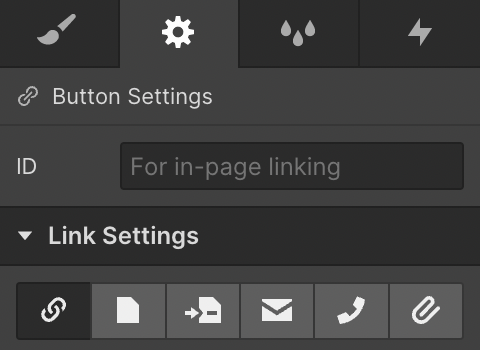

# Webflow NFT widgets

Connect web3 to Webflow without coding skills required.
## Lazy mint on Webflow


## Video guide
[](http://www.youtube.com/watch?v=4MMylTzzwAg)

## Starting out

This widget allows minting NFTs on your website. 

To start, you need an Ethereum NFT contract. [Create it via Buildship app](https://app.buildship.xyz), or test with an [example contract](https://github.com/buildship-dev/webflow-nft-components#example-for-testing).

**MetaverseNFT** contract by [buildship.xyz](https://buildship.xyz) is used by **40+** collections with **1000ETH+** in total volume.
It features **40% lower** mint gas fees, costs **~100$ in gas to deploy**, bullet-proof security and extensions like presale lists, mint passes, etc.


## How to use?
1. Open Webflow website editor
2. Create a new [Embedded HTML code](https://university.webflow.com/lesson/custom-code-embed) block (at least **Basic** site plan required)
3. Copy & paste this code in Webflow Embed block
```html
<script>
   CONTRACT_ADDRESS = "YOUR CONTRACT ADDRESS HERE"
   IS_TESTNET = false
   MAX_PER_MINT = 20
   // place to put CONTRACT_ABI = [{...}]
</script>
<script src="https://nftcomponents.vercel.app/static/js/main.js"></script>
<link href="https://nftcomponents.vercel.app/static/css/main.css" rel="stylesheet">
```
4. If you **have your Ethereum NFT contract**

   ✅ insert your contract address in `CONTRACT_ADDRESS` field 
   
   ✅ set `IS_TESTNET` to `false` or `true` depending on which network is the contract on: `Ethereum Mainnet` or `Rinkeby Testnet`.
   

If you **don't have a contract**, [create it via Buildship app](https://app.buildship.xyz)

> Your contract should be [verified](https://etherscan.io/verifyContract) on [Etherscan](https://etherscan.io). Otherwise you have to add `CONTRACT_ABI = [{...}]` line in the above code, with your full contract ABI inserted. If you have an error saying your ABI is too long, [click here](https://github.com/buildship-dev/webflow-nft-components/issues/22#issuecomment-1042708174).

6. Create a button with ID `mint-button` on your Webflow site

<!--  -->

On the left side, press Add and find Button


Select your button, then on the right side, set Button id to `mint-button`


If you can't set an ID, you can set a button URL as `mint-button` or `https://<your-website-url>/#mint-button`

7. You're done 🎉


### Example for testing
```html
<script>
   CONTRACT_ADDRESS = "0x8Fac2e25DFF0B248A19A66Ae8D530613c8Ff670B"
   IS_TESTNET = true
   MAX_PER_MINT = 20
</script>
<script src="https://nftcomponents.vercel.app/static/js/main.js"></script>
<link href="https://nftcomponents.vercel.app/static/css/main.css" rel="stylesheet">
```

### Available parameters
```html
<script>
   CONTRACT_ADDRESS = "YOUR CONTRACT ADDRESS HERE"
   CONTRACT_ABI = []
   NETWORK_ID = 4                      // defaults to 1: Ethereum network
   IS_TESTNET = true                   // true defaults to 4: Rinkeby network
   MAX_PER_MINT = 5                    // defaults to 20
   DEFAULTS = {
      hideCounter: false,              // hide minted counter from the dialog. Default: true
      contractMethods: {
         mint: 'myCustomMintMethod'    // defaults to "mint" or "publicMint"
      }
   }
   STYLES: {
      theme: 'dark'                    // Default: ''
   }
</script>
```

## FAQ

### I'm confused / it's not working, can you help me?
Yes, absolutely! You can [contact us in Discord](http://buildship.xyz/), or open a [GitHub issue](https://github.com/buildship-dev/webflow-nft-components/issues/new)

### How to add "Connect wallet" button?
Mint button will ask to connect wallet, so it's not necessary to add a "Connect wallet" button.

If you still want to do it, create a Webflow button with ID `connect`.

### How to add a custom minted counter?
Just create two text elements and assign them:
- `minted-counter` ID to display minted number
- `total-counter` ID to display collection size

### How to use this with Polygon, Binance, or other Ethereum-based networks?
It's easy! Set `NETWORK_ID` instead of `IS_TESTNET` in the code snippet

```html
<script>
   CONTRACT_ADDRESS = "YOUR CONTRACT ADDRESS HERE"
   NETWORK_ID = 1
   // remove IS_TESTNET line
   ...
</script>
<script ...>
<link ...>
```

Some of the network IDs you might use:
- Ethereum Mainnet: `NETWORK_ID = 1`
- Ethereum Rinkeby Testnet: `NETWORK_ID = 4`
- Polygon: `NETWORK_ID = 137`
- Binance: `NETWORK_ID = 56`
- For other IDs visit [Chainlist](https://chainlist.org)

### How to style minting dialog?
[See the example here](https://github.com/buildship-dev/webflow-nft-components/wiki/Mint-button-widget#how-to-style-minting-dialog)

### How to hide minted counter from the dialog?
You need to set `DEFAULTS.hideCounter` to `true`
```html
<script>
   CONTRACT_ADDRESS = "YOUR CONTRACT ADDRESS HERE"
   NETWORK_ID = 1
   DEFAULTS = {
       hideCounter: true
   }
   ...
</script>
<script ...>
<link ...>
```


If that instruction didn't work, check out our ready-to-use minting website template: https://textapes.art

[Contact us](https://buildship.xyz) to get this Webflow template, or to get help with this widget
