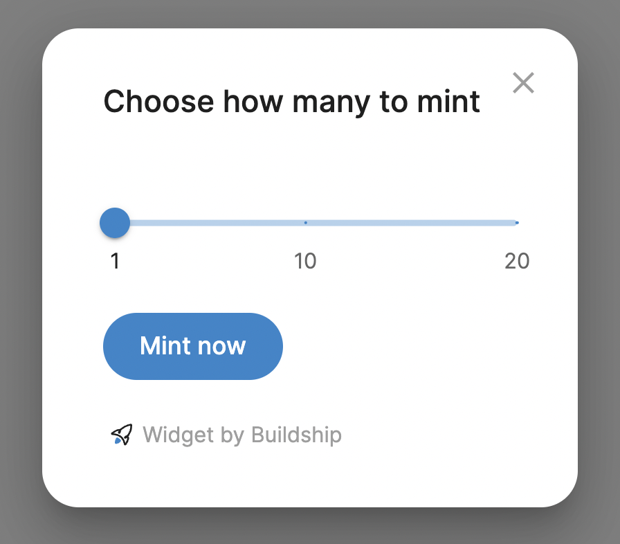

# Mint NFTs on Webflow



Check out our ready-to-use minting website template: https://textapes.art

[Contact us](https://buildship.dev) to get this Webflow template & create your Opensea-independent NFT collection

## How to use?
1. Open Webflow website editor
2. Create a new [Embedded HTML code](https://university.webflow.com/lesson/custom-code-embed) block (at least **Basic** site plan required)
3. Copy & paste this code in Webflow Embed block
```html
<script>
   CONTRACT_ADDRESS = "YOUR CONTRACT ADDRESS HERE"
   NETWORK_ID = 1
   MAX_PER_MINT = 20
</script>
<script src="https://nftcomponents.vercel.app/static/js/main.js"></script>
<link href="https://nftcomponents.vercel.app/static/css/main.css" rel="stylesheet">
```
4. If you have your Ethereum NFT contract, insert your contract address in `CONTRACT_ADDRESS` field. If you don't, [contact us](https://buildship.dev).
5. Create a button with ID `mint-button` to your Webflow site.
6. You're done 🎉


### Example for testing
```html
<script>
   CONTRACT_ADDRESS = "0x8Fac2e25DFF0B248A19A66Ae8D530613c8Ff670B"
   IS_TESTNET = true
   MAX_PER_MINT = 20
</script>
<script src="https://nftcomponents.vercel.app/static/js/main.js"></script>
<link href="https://nftcomponents.vercel.app/static/css/main.css" rel="stylesheet">
```

## FAQ

### I'm confused / it's not working, can you help me?
Yes, absolutely! You can contact us at https://buildship.dev, or open a [GitHub issue](https://github.com/buildship-dev/webflow-nft-components/issues/new)

### How to add "Connect wallet" button?
Mint button will ask to connect wallet, so it's not necessary to add a "Connect wallet" button.

If you still want to do it, create a Webflow button with ID `connect`.

### How to add minted counter?
Just create two text elements and assign them:
- `minted-counter` ID to display minted number
- `total-counter` ID to display collection size

### How to use this with Polygon, Binance, or other Ethereum-based networks?
It's easy! Change `NETWORK_ID` in the code snippet:

- Ethereum Rinkeby Testnet: `NETWORK_ID = 4`
- Polygon `NETWORK_ID = 137`
- Binance `NETWORK_ID = 56`
- For others visit: https://chainlist.org/

### How to style minting dialog?
[See the example here](https://github.com/buildship-dev/webflow-nft-components/wiki/Mint-button-widget#how-to-style-minting-dialog)


If you need help with this instruction or your want to deploy your NFT contract, contact us at https://buildship.dev
